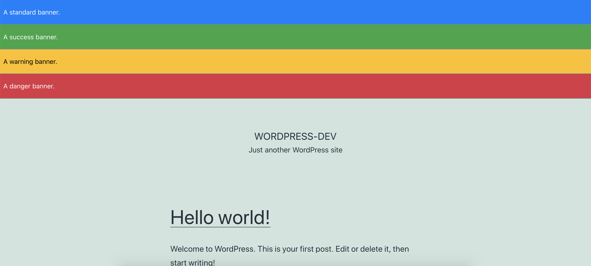

# WordPress Site Banner

Easily add custom banners to the top of every page of your WordPress site

## Usage

After installing the plugin, a new "Banners" section will appear in the admin menu. Simply add a new Banner using the options on this menu and it will automatically appear on your website.

Optionally, select one of several preset banner types to correspond with the type of message you are displaying:
* Standard
* Success
* Warnings
* Danger